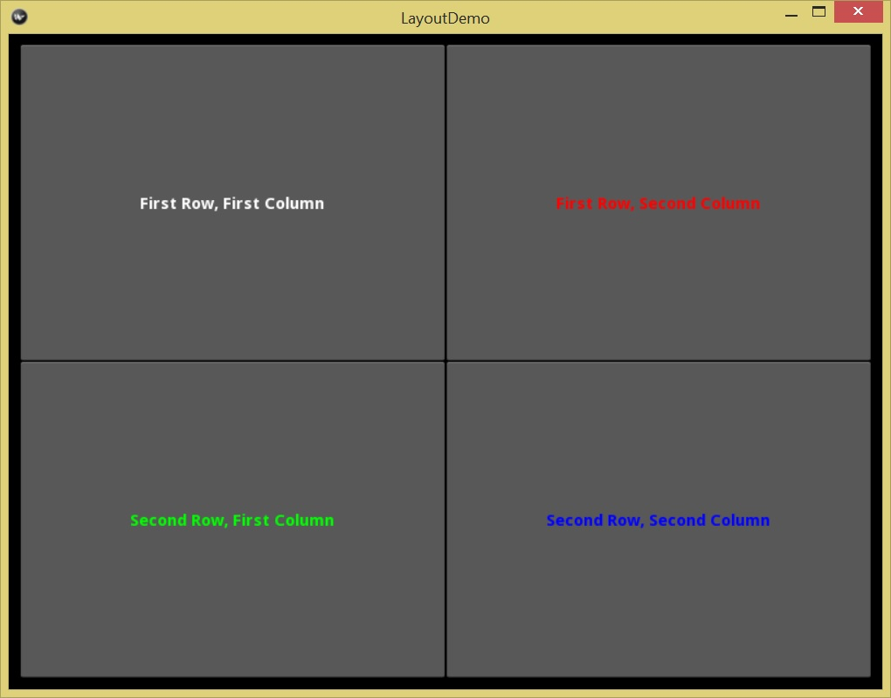
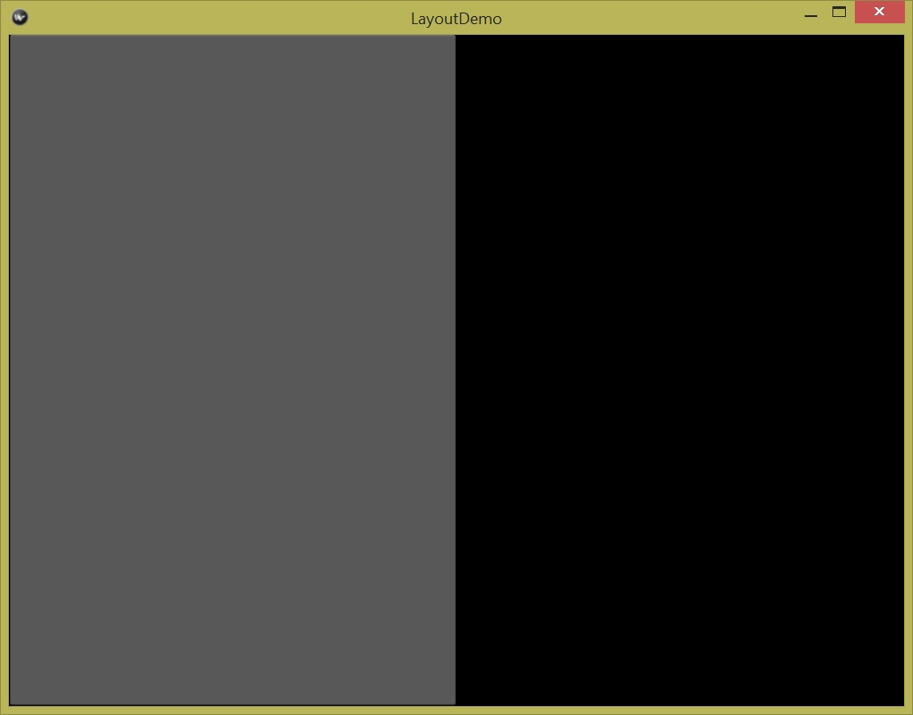

# Organizing with Layouts
## Why Layouts?
Usually a user interface has many components (widgets) that 
should be displayed properly, if not beautifully, to have a 
good user experience. Controlling the size and position of all
widgets in a user interface that may change its size, location, 
orientation and react promptly to a user interaction is a complex
task. Kivy provides several layout widgets to automate many 
layout management tasks. The following `layoutdemo.kv` file in 
[./source/0401](./source/0401) places four buttons in a 2 by 2
grid. 
 
```
BoxLayout:
    orientation: 'vertical'
    padding: 10
    BoxLayout:
        Button:
            text: "First Row, First Column"
            bold: True
        Button:
            text: "First Row, Second Column"
            color: [1, 0, 0, 1]
            bold: True
    BoxLayout:
        Button:
            text: "Second Row, First Column"
            color: [0, 1, 0, 1]
            bold: True
        Button:
            text: "Second Row, Second Column"
            color: [0, 0, 1, 1]
            bold: True
```

All buttons have the same size and aligned properly. All buttons are
10px (padding) away from the window. The user interface is 
shown in the following diagram. 



Without any calculation of the size and position, we have something
that work out of the box. More importantly, if we resize the window, 
all buttons change their size and positions correspondingly to keep
the grid view with the same spacing and padding settings. 

## Kivy Layouts
Following are Kivy layout widgets that help developers to 
manage the layout of a user interface:

* `BoxLayout`: children are arranged next to each other either in
vertical or horizontal direction. In the vertical arrangement, all
children have the same width as the parent `BoxLayout` widget. 
In the horizontal arrangement, all children have the same height
as the parent `BoyLayout` widget. 
* `GridLayout`: children are arranged in a grid that has columns 
and rows. 
* `StackLayout`: similar to `BoxLayout`, children are arranged
next to each either in vertical or horizontal direction. 
However, in the vertical arrangement, we can specify the width
of a child widget. In the horizontal arrangement, we can specify
the height of a child widget. 
* `AnchorLayout`: a child can anchor to a set of predefined positions of 
its parent layout. The position can be `left`, `right`, `center`,
`top` and `bottom`. 
* `FloatLayout`: this is a flexible layout that allows a child to have
arbitrary position and size. 
* `RelativeLayout`: Similar to `FloatLayout`, except that a child's 
positions are relative to layout position. 
* `PageLayout`: like a book page, it flips children using borders.
* `ScatterLayout`: a flexible and fancy layout allows 
zoom and rotation of its children.
  
The [Kivy document page](http://kivy.org/docs/guide/widgets.html#organize-with-layouts)
has more information and animated picture of the first five layouts. 
A good news is that the `BoxLayout` is simple and good enough 
for many tasks. When multiple `BoxLayout` are combined and nested, it is
flexible in placing widgets in the right position with the right size. 
We will use `BoxLayout` in most examples.

## Box Layout
When a `BoxLayout` is used to manage a user interface layout, the 
widget placement is easy to understand: in default, a box layout 
places one child next to each other, either vertically from top to bottom
or horizontally from left to right.

In the above example application in [./source/0401](./source/0401),
three box layouts are used to arrange four buttons in a 2 by 2 grid. 
The root widget is a `BoxLayout` widget that has two `BoxLayout` 
widgets as its children. The root widget use a vertical orientation 
that places the two nested box layouts from the top to the bottom.

In the nested box layouts, we don't specify the `orientation` property. 
They use the default "horizontal" orientation to place child widgets
from the left to the right. 

In addition to the `orientation` property, the `BoxLayout` has 
a `padding` property and a `spacing` property. The `padding` 
specifies property the padding between a box layout widget and its 
inside children. the `spacing` property specifies spaces between 
its children. 

Though grid layout or other layouts can also be used to put 
the buttons in a 2 by 2 grid, generally we like the box layout 
for its simplicity, fine control and flexibility. 

## Widget Size
There are two types of size in Kivy: absolute size and size hint.
The absolute size is easy to understand because it use a numeric 
value and a metrics unit to declare the size. 
A numeric value is an `int` or a `float` with a default value of 0. 
A size value has a unit that has a default value of 'px'. 

The default 'px' stands for 'pixel'. It is a 'dot' -- the minimum
display unit in a screen. The physical sizes of a pixel 
may be different because different screen may have different 
resolution. A pixel in a low resolution screen is bigger than
a high resolution screen with the same size.  

Other units include 'mm', 'cm', 'in', 'dp' and 'sp'. 
Among these units, 'mm', 'cm', and 'in' are physical size 
unit that are fixed. One inch in a widget is the same one 
inch in a highway. So are the millimeter and centimeter unit.

The `dp` standards for "density-independent pixels" or 
"display pixel". It is a size that is resolution-independent. 
To make it simple, we can think it as 1/72 inch -- like a pixel in a
typical laptop. In other words, one inch is roughly equals to 72dp.
It is recommend to use `dp` to specify widget size.

The `sp` standards for `scale-independent pixels`. It is like
the `dp` unit but scales with the user's font size. 
It is recommended to use `sp` as the unit for font size. 

The size-related properties include `width`, `height`, `size` and
`font-size`. The `size` is a tuple of `(width, height)`.

In general, there are two simple metric unit recommendations:

* Use `dp` for `width` and `height`
* Use `sp` for `font-size`

Below are some examples of absolute sizes: 

```python
username_text_input.width = '200dp'
ok_button.height = '200dp'
rectangle.size = ('60dp', '20dp')
user_label.font_size = '15sp'
```

In Kivy, the default size of a widget is `(100px, 100px)`. 
 
## Size Hint
Size hints are relative size. They are `int` or `float` values
without a unit. A widget has three relative size properties:

* `size_hint_x`: the relative width
* `size_hint_y`: the relative height
* `size_hint`: the combined relative size of `(size_hint_x, size_hint_y)`.

In default, all widgets in a layout has a size hint value of 1.
It means that all widgets in a layout have the same width and the 
same height. A size hint value is only meaningful when compared 
with other hint size values in the same parent layout. 
In the following sample code in [./source/0402](./source/0402), 
we use relative size to specify the height and width inside a
box layout: 

```
BoxLayout:
    orientation: 'vertical'
    padding: "10dp"
    BoxLayout:
        size_hint_y: 200
        Button:
            size_hint_x: 2
        Button:
            size_hint_x: 6
    BoxLayout:
        size_hint_y: 600
        Button:
            size_hint_x: 2
        Button:
            size_hint_x: 0.5
```

In the above code we use float, small and big numbers. 
Each number is only meaning when it is compared with 
another child in the same parent layout. For example, 
the height of buttons in the first row is 1/3 of 
the height of the buttons in the second row because of 
the ratio of 200 : 600. For the same reason, in the second 
row, the fist button is four times as wide as the second 
button because of the ratio of 2 : 0.5. 

The user interface is shown in the following diagram. 


## Using Absolute Size in a Layout
When use an absolute size for a child widget in a layout, we must 
explicitly set the corresponding size hint to `None`. Otherwise,
Kivy still use the default relative hint size of 1 as the 
size of a child widget. For example, the `height` and `width` 
property don't work in the following Kv code in [./source/0403](./source/0403).

```
BoxLayout:
    orientation: 'vertical'
    BoxLayout:
        height: "200dp"
        Button:
            size_hint_x: 2
        Button:
            size_hint_x: 6
    BoxLayout:
        height: "200dp"
        width: "200dp"
        Button:
            size_hint_x: 2
        Button:
            size_hint_x: 0.5
```

The user interface for the above code is shown in the following diagram. 



When we set the corresponding size hint to `None`, as shown in the 
following code in [./source/0403](./source/0403), it gives the correct
result. 

```
BoxLayout:
    orientation: 'vertical'
    BoxLayout:
        height: "200dp"
        size_hint_y: None
        Button:
            size_hint_x: 2
        Button:
            size_hint_x: 6
    BoxLayout:
        height: "200dp"
        size_hint_y: None
        width: "200dp"
        size_hint_x: None
        Button:
            size_hint_x: 2
        Button:
            size_hint_x: 0.5
```

The user interface for the above code is shown in the following diagram. 


## Exercises
Please implement a user login window that has the following components:

* A "Welcome" text at the top middle of the window.
* A "User Name: " text followed by an input box
* A "Password: " text followed by an input box
* A button has a text "Submit" at the button center of the window.
 
Please make sure that the size and position of everything 
look good in both a smart phone and in a large 30 inch 
computer monitor. The left side of two texts should be horizontally
aligned . So are the left side of two input boxes.  
